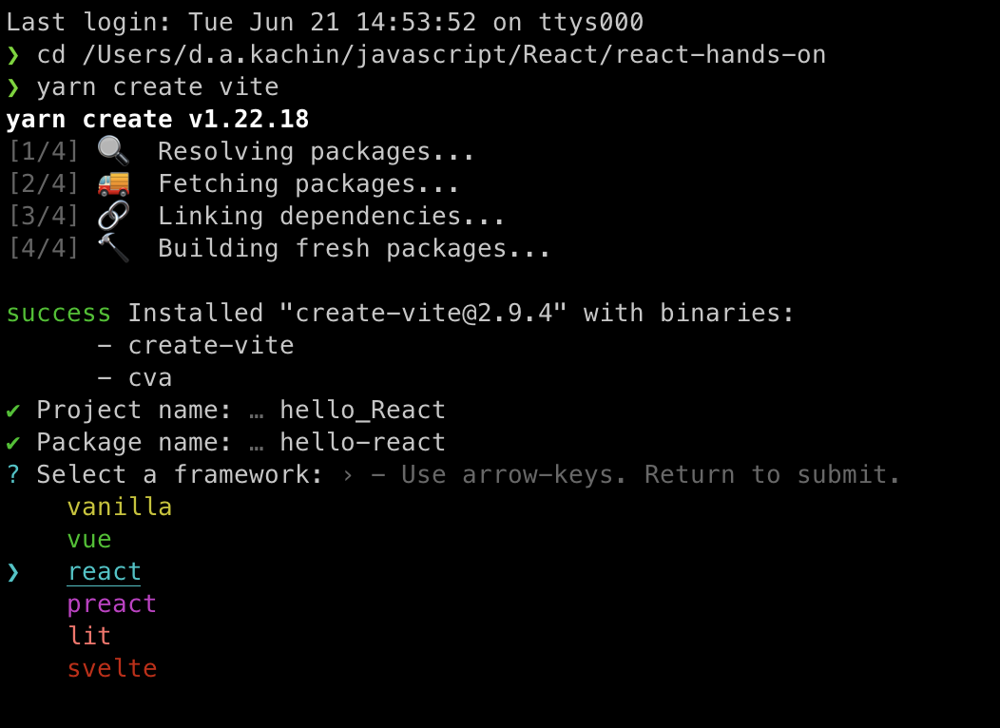
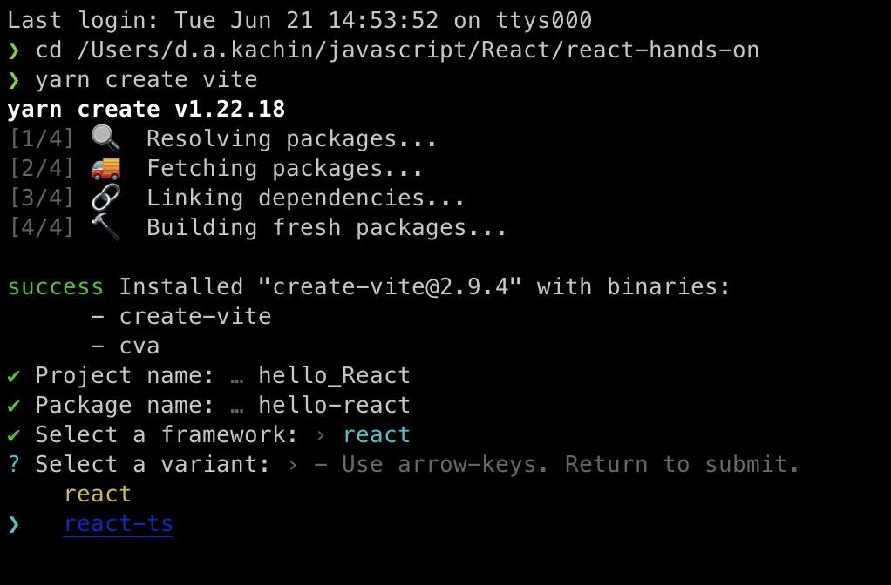
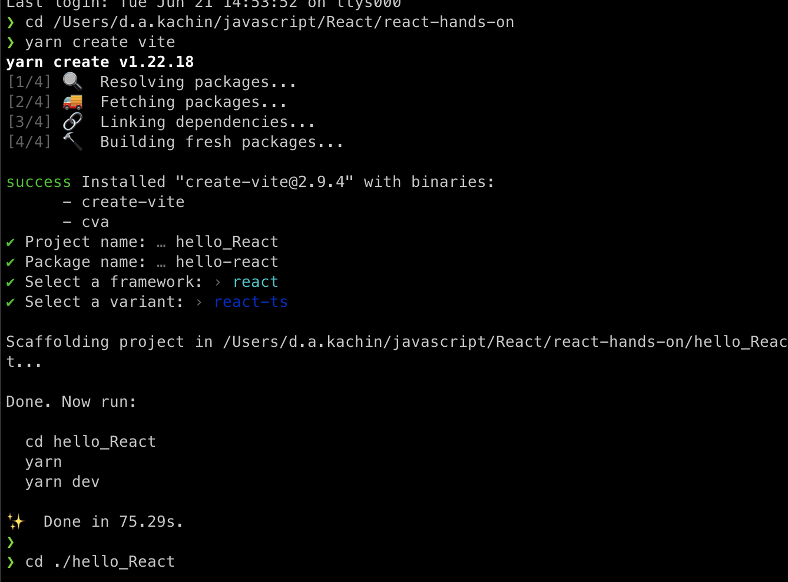
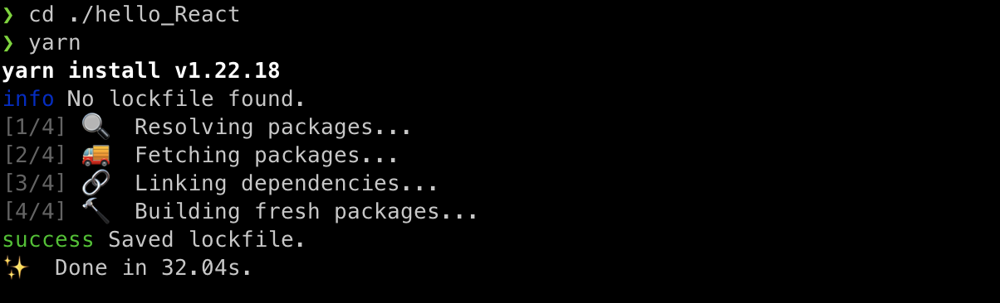
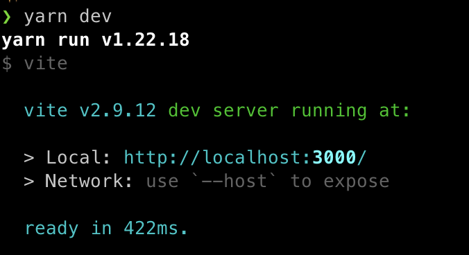
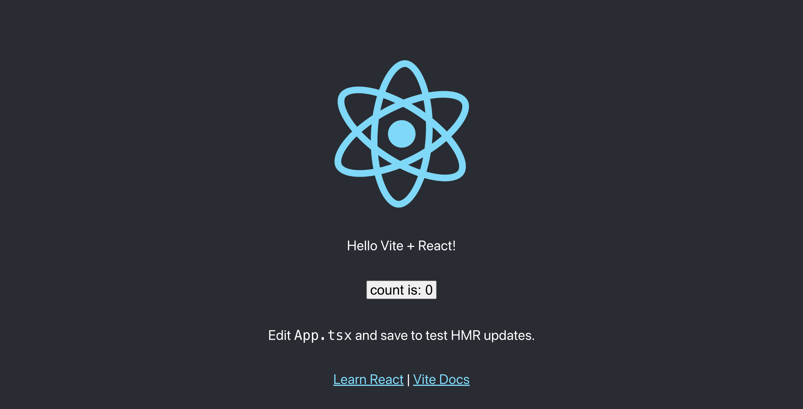

# React(vite)

忘れない用の手順書

参考サイト:[Vite で最速 React & TypeScript](https://github.com/facebook/create-react-app)

作成したいファイル上で

```
yarn create vite
```



projectname と packagename を入力（同じでいい？）

react を選択
→ react-ts を選択


projectname と同じファイルが出来上がるので移動


移動したファイル上で

```
yarn
```

するとインストールが始まる



インストール完了後

```
yarn dev
```

で起動する


